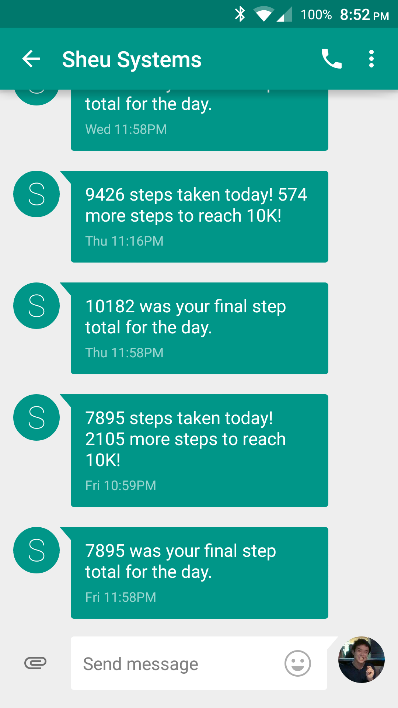

# Fitbit Assistant

A Python script you can run on a personal server to send yourself end-of-the-day Fitbit text messages.

- Uses Fitbit API for step count data
- Uses Twilio for text messaging
- Uses Python sched for scheduling
- Uses ConfigParser for safe API keys

Date authored: July 14, 2015
  
## Example of text messages:
- Example of sending a "steps left" text at 11 p.m., and then a final count at 11:59 p.m.

